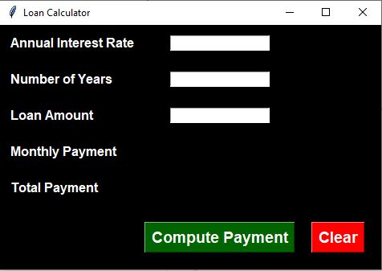

# Loan-Calculator-py

This was a mini python project. The purpose of this project was to create a loan calculator and to further practice using the tkinter GUI.

# How it works

In order to use this application, you will need to input the Annual Interest rate, Number of years and the loan amount. Once all these have been entered click on "Compute Payment" and the program will return the monthly and total payment.

# Tech Used

For this project I used Python and the tkinter module.

# How to use it

To try out this app, clone or download the repo and run the app.py file in your preferred IDE. I used VScode but any other compatible IDE should be fine!
